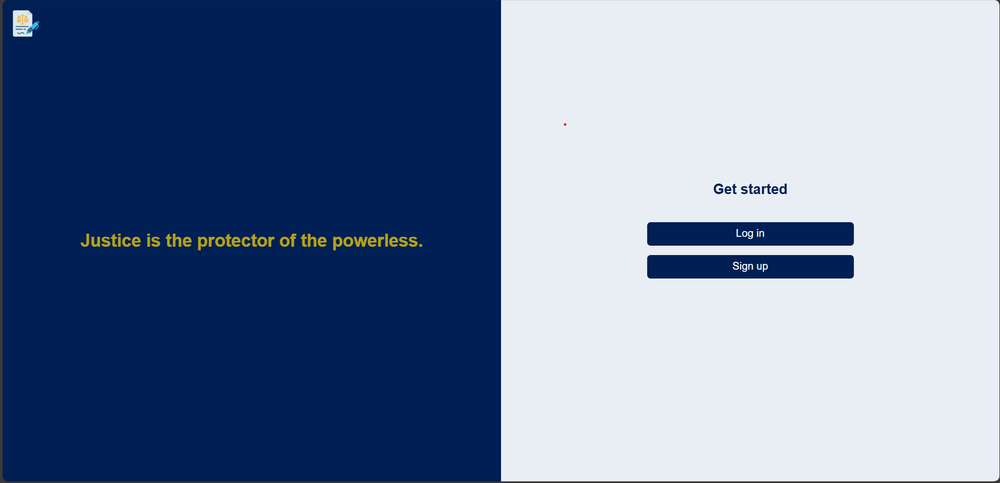

# AI Powered Legal Aid Assistance

🚀 **Live Demo:** [AI Legal Aid Assistant](https://legal-aid-assistant-by-ahsan-and-shafiullah-bn7c.vercel.app/)

## 📌 Project Description
AI Powered Legal Aid Assistance is a web application that allows users to submit their legal queries and receive AI-generated legal responses using Google Gemini API.

## 🛠 Tech Stack
- **Frontend:** React.js, Tailwind CSS, ShadCN
- **Backend:** Next.js, TypeScript
- **Database:** MongoDB
- **Authentication:** JWT, NextAuth, OAuth
- **AI API:** Google Gemini

## 📂 Folder Structure
```
├── frontend/    # React.js UI
├── backend/     # Next.js API routes
├── database/    # MongoDB connection setup
├── public/      # Static assets
└── README.md
```

## 🔧 Installation & Setup
```bash
# Clone the repository
git clone https://github.com/your-username/ai-legal-aid-assistant.git

# Navigate to the project directory
cd ai-legal-aid-assistant

# Install dependencies
npm install

# Start the development server
npm run dev
```

## 📌 Features
- ✅ AI-powered legal responses
- ✅ User authentication (NextAuth, JWT, OAuth)
- ✅ Secure API for handling queries
- ✅ Responsive UI with Tailwind CSS & ShadCN
- ✅ MongoDB for storing user interactions

This is a [Next.js](https://nextjs.org) project bootstrapped with [`create-next-app`](https://nextjs.org/docs/app/api-reference/cli/create-next-app).

## Getting Started

First, run the development server:

```bash
npm run dev
# or
yarn dev
# or
pnpm dev
# or
bun dev
```

Open [http://localhost:3000](http://localhost:3000) with your browser to see the result.

You can start editing the page by modifying `app/page.tsx`. The page auto-updates as you edit the file.

This project uses [`next/font`](https://nextjs.org/docs/app/building-your-application/optimizing/fonts) to automatically optimize and load [Geist](https://vercel.com/font), a new font family for Vercel.

## Learn More

To learn more about Next.js, take a look at the following resources:

- [Next.js Documentation](https://nextjs.org/docs) - learn about Next.js features and API.
- [Learn Next.js](https://nextjs.org/learn) - an interactive Next.js tutorial.

You can check out [the Next.js GitHub repository](https://github.com/vercel/next.js) - your feedback and contributions are welcome!

## Deploy on Vercel

The easiest way to deploy your Next.js app is to use the [Vercel Platform](https://vercel.com/new?utm_medium=default-template&filter=next.js&utm_source=create-next-app&utm_campaign=create-next-app-readme) from the creators of Next.js.

Check out our [Next.js deployment documentation](https://nextjs.org/docs/app/building-your-application/deploying) for more details.

## 🔑 Environment Variables
Create a `.env` file in the root directory and add:
```env
NEXT_PUBLIC_GEMINI_API_KEY=your_api_key
NEXTAUTH_SECRET=your_secret
DATABASE_URL=mongodb+srv://your_connection_string
```

## 📸 Screenshots


## 📜 License
_(Specify your project license here, e.g., MIT)_

## 🤝 Contributors
- **Your Name** – [GitHub](https://github.com/Shafiullah717) | [LinkedIn](https://www.linkedin.com/in/shafi-ullah-086b83284/)

---
Feel free to update this README with additional details! 🚀
